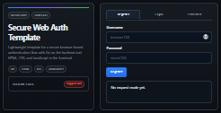

#####

<div align="center">
    
    <h2 align="center">Welcome to <code>Secure Web Auth Template</code></h2>
</div>

[](https://github.com/sven-seyfert/secure-web-auth-template/blob/main/LICENSE.md)
[](https://github.com/sven-seyfert/secure-web-auth-template/releases/latest)
[](https://github.com/sven-seyfert/secure-web-auth-template/blob/main/go.mod)
[](https://github.com/sven-seyfert/secure-web-auth-template/commits/main)
[](https://github.com/sven-seyfert/secure-web-auth-template/graphs/contributors)

[Description](#description) | [Features](#features) | [Getting started](#getting-started) | [Authentication flow](#authentication-flow) | [Security notes](#security-notes) | [License](#license) | [Acknowledgements](#acknowledgements)

---

## Description

A lightweight starter repository for building secure web authentication flows with a Go backend and a browser-based frontend using HTML, CSS, and JavaScript.

This project is designed as a reusable template for simple login, registration, session handling, and CSRF-protected requests in small web applications. It keeps the structure intentionally compact and easy to understand so it can be adapted quickly for new projects or internal prototypes.

### Why this template exists

When a project needs a small, secure authentication baseline without the overhead of a large framework, this repository provides a practical starting point.

It focuses on the core patterns that matter most for a lightweight web auth flow:

- user registration and login
- session-based authentication with cookies
- CSRF protection for protected actions
- simple backend route structure
- browser UI that demonstrates the flow clearly

This is not meant to replace a full production auth system, but it is useful as a secure starting point for small apps, prototypes, internal tools, or secure demo environments.

## Features

- Go HTTP server with route-based API design
- Cookie-based session handling
- Single active session per user by design
- CSRF token validation for protected requests
- Browser UI with login, register, logout, and protected action flows
- Minimal project layout optimized for readability and reuse
- Easy local testing and extension

## Getting started

1. Run the app:

```bash
# run by go
go run main.go

# run by Makefile
make run
```

2. Optional: Build the app instead of running:

```bash
# run by go
go build -o secure-web-auth-template.exe main.go

# run by Makefile
make build
```

3. Open the application in the browser:

```text
http://localhost:8080
```

4. Use the register and login forms to test the flow and review how the session and CSRF cookies are handled.

> [!TIP]
> Check out the other Makefile commands (options).

### Typical use cases

This repository is useful when you want a clean, compact, and understandable baseline for:

- internal admin authentication
- small SaaS prototypes
- secure demo applications
- browser-based auth experiments
- Go + frontend starter projects

## Authentication flow

The default flow included in this template is intentionally simple and educational:

- register a user
- log in with valid credentials
- receive session and CSRF cookies
- call a protected endpoint with the CSRF token in the request header
- log out and clear session state

### Session model

This template intentionally uses a single active session per user. The backend stores one session token and one CSRF token for each user account, and a second login attempt while a valid session already exists is rejected with a conflict response.

This is a deliberate lightweight design choice for a small secure auth starter. It keeps the implementation easy to understand, predictable, and safer to reason about for a template or prototype. It is not meant to represent a multi-session product design with device-level session management.

## Security notes

This repository is intended as a learning and template-focused implementation. It demonstrates common secure web patterns, but it should still be treated as a starting point rather than a production-ready security system.

For real-world use, additional hardening is recommended:

- enforce HTTPS in production
- use a persistent database instead of in-memory storage
- rotate and invalidate session identifiers properly
- add rate limiting and lockout protection
- validate and sanitize all input
- add logging, monitoring, and audit controls
- review CSRF, session handling, and cookie settings for your deployment environment

## License

This project is provided as a template for learning and reuse.

Copyright (c) 2026 Sven Seyfert (SOLVE-SMART)<br>
Distributed under the MIT License. See [LICENSE](https://github.com/sven-seyfert/secure-web-auth-template/blob/main/LICENSE.md) for more information.

## Acknowledgements

- Opportunity by [GitHub](https://github.com)
- Badges by [Shields](https://shields.io) and [SimpleIcons](https://simpleicons.org)
- Thanks to the authors, maintainers and contributors of the various projects and products
  - [golang](https://github.com/golang/go) by the Go team at Google; License: [BSD-3-Clause](https://github.com/golang/go/blob/master/LICENSE)
  - [cURL](https://github.com/curl/curl) by Daniel Stenberg; License: [MIT](lib/curl-license.txt)
  - [SQLite](https://www.sqlite.org/copyright.html) by Richard Hipp; License: [Public Domain](https://www.sqlite.org/copyright.html)
  - [go-sqlite](https://github.com/zombiezen/go-sqlite) by Roxy Light; License: [ISC](https://github.com/zombiezen/go-sqlite/blob/main/LICENSE)

##

[To the top](#description)
